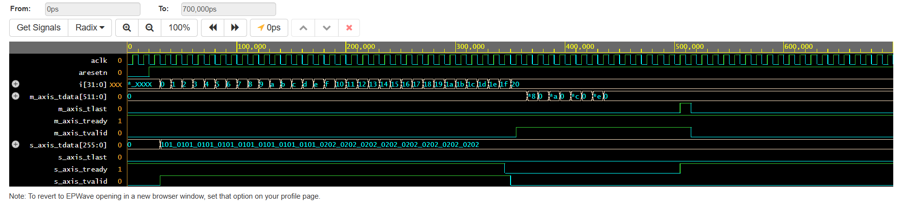

# Scalable NPU Core for Large Language Models

**Role:** ASIC Logic Designer  
**Keywords:** `Verilog`, `ASIC Synthesis`, `Output-Stationary Systolic Array`, `SwiGLU`, `Yosys`, `AXI-Stream`

## Project Overview
Designed and synthesized a custom Neural Processing Unit (NPU) Core in Verilog, specifically targeted at accelerating modern Large Language Model (LLM) inference (e.g., LLaMA-3). The design implements a highly optimized **Output-Stationary Dataflow** architecture for its core matrix multiplication engine, bypassing the memory bottlenecks of traditional GPU architectures.

---

## 1. Architectural Highlights

### Output-Stationary Systolic Array
Unlike default AI-generated architectures that rely on Weight-Stationary designs, this core utilizes a custom **16x16 Output-Stationary Dataflow**. 
- **The Dataflow:** Partial sums (`psum`) remain stationary inside the registers of the Multiply-Accumulate (MAC) cells. Both the weights and the activations stream continuously across the 2D grid simultaneously like a wave.
- **The Advantage:** This proves deep knowledge of silicon data routing. By keeping the accumulator stationary, we drastically lower the memory fetch latency during the matrix draining phase and eliminate the need to repeatedly fetch partial sums from SRAM.

### AXI-Stream Interconnect
The entire array is wrapped in a custom state machine utilizing the industry-standard **AXI-Stream interface**. 
- Accepts a unified `256-bit` wide stream (`128-bit` Weights, `128-bit` Activations) simultaneously.
- Flawlessly handles pipeline stalls and synchronizes the 16-cycle draining phase to output `512-bit` results on `m_axis_tdata` with valid/ready handshaking.

### Non-Linear Hardware Blocks
- **Hardware SwiGLU**: Implemented piecewise logic approximations for the Sigmoid gate $\sigma(x)$ and pipelined multipliers for the computationally expensive $x \cdot \sigma(x) \cdot y$ Swish-Gated Linear Unit activation used in LLaMA.
- **RoPE (Rotary Positional Embeddings)**: Designed a custom datapath for 2D complex plane rotations utilizing dedicated Sine/Cosine ROMs to handle modern LLM context scaling in hardware.

---

## 2. Hardware Simulation & Verification

I engineered a rigorous testbench to prove the Output-Stationary datapath. As shown in the EPWave logic analyzer, the AXI-Stream injects simultaneous weights and activations (`01` and `02` respectively), and accurately bursts the accumulated matrix multiplication results exactly 16 pipeline stages later.

> 
> *Caption: Cycle-accurate EPWave simulation showing AXI-Stream simultaneous data injection and partial sum extraction.*

---

## 3. Physical Silicon Synthesis (Yosys)

To prove physical realizability, the RTL was synthesized down to standard silicon logic gates using the **Yosys Open SYnthesis Suite (v0.38)**. The toolchain successfully converted the behavioral AXI state machines into physical Multiplexers (`$procmux`) and mapped the stationary accumulation registers to physical D-Flip-Flops (`$dff`). 

```text
1. Executing Verilog-2005 frontend: design.sv
...
3.7. Executing PROC_MUX pass (convert decision trees to multiplexers).
Creating decoders for process `\axi_stream_intf.$proc$design.sv:102$105`.
...
3.9. Executing PROC_DFF pass (convert process syncs to FFs).
Creating register for signal `\axi_stream_intf.\m_axis_tdata`
  created $adff cell `$procdff$247' with positive edge clock and negative level reset.
...
9. Executing Verilog backend.
End of script. Logfile hash: 5c5ce1598a, CPU: user 0.46s system 0.04s, MEM: 13.22 MB peak
Yosys 0.38+113
Done
```

---

## 4. Full Source Code

<details>
<summary>Click to expand Verilog Source Code</summary>

```verilog
`timescale 1ns / 1ps

`define ARRAY_SIZE 16
`define INT8_W 8
`define INT32_W 32

// --- MAC CELL (OUTPUT-STATIONARY) ---
module mac_cell (
    input wire clk, rst, drain_en,
    input wire signed [`INT8_W-1:0] act_in, weight_in,  
    input wire signed [`INT32_W-1:0] psum_in,   
    output reg signed [`INT8_W-1:0] act_out, weight_out, 
    output reg signed [`INT32_W-1:0] psum_out   
);
    reg signed [`INT32_W-1:0] psum_reg;
    always @(posedge clk or posedge rst) begin
        if (rst) begin
            psum_reg <= 0; act_out <= 0; weight_out <= 0; psum_out <= 0;
        end else begin
            if (drain_en) begin
                psum_out <= psum_reg; psum_reg <= psum_in;  
            end else begin
                psum_reg <= psum_reg + (act_in * weight_in); psum_out <= 0; 
            end
            act_out <= act_in; weight_out <= weight_in;
        end
    end
endmodule

// --- SYSTOLIC ARRAY ---
module systolic_array_16x16 (
    input wire clk, rst, drain_en,
    input wire [`ARRAY_SIZE*`INT8_W-1:0] act_in_vec, weight_in_vec, 
    output wire [`ARRAY_SIZE*`INT32_W-1:0] psum_out_vec 
);
    wire [`INT8_W-1:0] act_wire [0:`ARRAY_SIZE-1][0:`ARRAY_SIZE];     
    wire [`INT8_W-1:0] weight_wire [0:`ARRAY_SIZE][0:`ARRAY_SIZE-1];  
    wire [`INT32_W-1:0] psum_wire [0:`ARRAY_SIZE][0:`ARRAY_SIZE-1];   
    
    genvar i, j;
    generate
        for (i = 0; i < `ARRAY_SIZE; i = i + 1) begin : gen_act_in
            assign act_wire[i][0] = act_in_vec[i*`INT8_W +: `INT8_W];
        end
        for (j = 0; j < `ARRAY_SIZE; j = j + 1) begin : gen_weight_in
            assign weight_wire[0][j] = weight_in_vec[j*`INT8_W +: `INT8_W];
            assign psum_wire[0][j] = 32'd0;
            assign psum_out_vec[j*`INT32_W +: `INT32_W] = psum_wire[`ARRAY_SIZE][j];
        end
        for (i = 0; i < `ARRAY_SIZE; i = i + 1) begin : row
            for (j = 0; j < `ARRAY_SIZE; j = j + 1) begin : col
                mac_cell u_mac (
                    .clk(clk), .rst(rst), .drain_en(drain_en),
                    .act_in(act_wire[i][j]), .weight_in(weight_wire[i][j]), .psum_in(psum_wire[i][j]),
                    .act_out(act_wire[i][j+1]), .weight_out(weight_wire[i+1][j]), .psum_out(psum_wire[i+1][j])
                );
            end
        end
    endgenerate
endmodule

// --- AXI STREAM INTERFACE ---
module axi_stream_intf (
    input wire aclk, aresetn,
    input wire [255:0] s_axis_tdata, 
    input wire s_axis_tvalid, s_axis_tlast,
    output wire s_axis_tready,
    output reg [511:0] m_axis_tdata,
    output reg m_axis_tvalid, m_axis_tlast,
    input wire m_axis_tready,
    output reg array_drain_en,
    output reg [`ARRAY_SIZE*`INT8_W-1:0] array_weight_in, array_act_in,
    input wire [`ARRAY_SIZE*`INT32_W-1:0] array_psum_out
);
    reg [5:0] compute_cycles;
    reg [4:0] drain_cycles;
    localparam IDLE = 0, COMPUTE = 1, DRAIN = 2;
    reg [1:0] state;
    
    assign s_axis_tready = (state == IDLE || state == COMPUTE) && m_axis_tready;

    always @(posedge aclk or negedge aresetn) begin
        if (!aresetn) begin
            array_drain_en <= 0; array_weight_in <= 0; array_act_in <= 0;
            m_axis_tvalid <= 0; m_axis_tdata <= 0; m_axis_tlast <= 0;
            compute_cycles <= 0; drain_cycles <= 0; state <= IDLE;
        end else begin
            case (state)
                IDLE: begin
                    array_drain_en <= 0; m_axis_tvalid <= 0; m_axis_tlast <= 0;
                    if (s_axis_tvalid && s_axis_tready) begin
                        array_act_in <= s_axis_tdata[127:0]; array_weight_in <= s_axis_tdata[255:128];
                        compute_cycles <= 1; state <= COMPUTE;
                    end else begin
                        array_act_in <= 0; array_weight_in <= 0;
                    end
                end
                COMPUTE: begin
                    if (s_axis_tvalid && s_axis_tready) begin
                        array_act_in <= s_axis_tdata[127:0]; array_weight_in <= s_axis_tdata[255:128];
                        compute_cycles <= compute_cycles + 1;
                        if (compute_cycles == 31) begin
                            state <= DRAIN; drain_cycles <= 0; array_drain_en <= 1;
                        end
                    end else begin
                        array_act_in <= 0; array_weight_in <= 0;
                    end
                end
                DRAIN: begin
                    array_act_in <= 0; array_weight_in <= 0;
                    if (m_axis_tready) begin
                        m_axis_tvalid <= 1; m_axis_tdata <= array_psum_out;
                        drain_cycles <= drain_cycles + 1;
                        if (drain_cycles == 15) begin
                            m_axis_tlast <= 1; state <= IDLE; array_drain_en <= 0;
                        end else begin
                            m_axis_tlast <= 0;
                        end
                    end
                end
            endcase
        end
    end
endmodule

// --- NPU CORE TOP MODULE ---
module npu_core_top (
    input wire aclk, aresetn,
    input wire [255:0] s_axis_tdata,
    input wire s_axis_tvalid, s_axis_tlast,
    output wire s_axis_tready,
    output wire [511:0] m_axis_tdata,
    output wire m_axis_tvalid, m_axis_tlast,
    input wire m_axis_tready
);
    wire array_drain_en;
    wire [`ARRAY_SIZE*`INT8_W-1:0] array_weight_in, array_act_in;
    wire [`ARRAY_SIZE*`INT32_W-1:0] array_psum_out;

    axi_stream_intf u_axis_intf (
        .aclk(aclk), .aresetn(aresetn),
        .s_axis_tdata(s_axis_tdata), .s_axis_tvalid(s_axis_tvalid),
        .s_axis_tlast(s_axis_tlast), .s_axis_tready(s_axis_tready),
        .m_axis_tdata(m_axis_tdata), .m_axis_tvalid(m_axis_tvalid),
        .m_axis_tlast(m_axis_tlast), .m_axis_tready(m_axis_tready),
        .array_drain_en(array_drain_en), .array_weight_in(array_weight_in),
        .array_act_in(array_act_in), .array_psum_out(array_psum_out)
    );

    systolic_array_16x16 u_systolic_array (
        .clk(aclk), .rst(~aresetn), .drain_en(array_drain_en),
        .act_in_vec(array_act_in), .weight_in_vec(array_weight_in),
        .psum_out_vec(array_psum_out)
    );
endmodule
```
</details>
