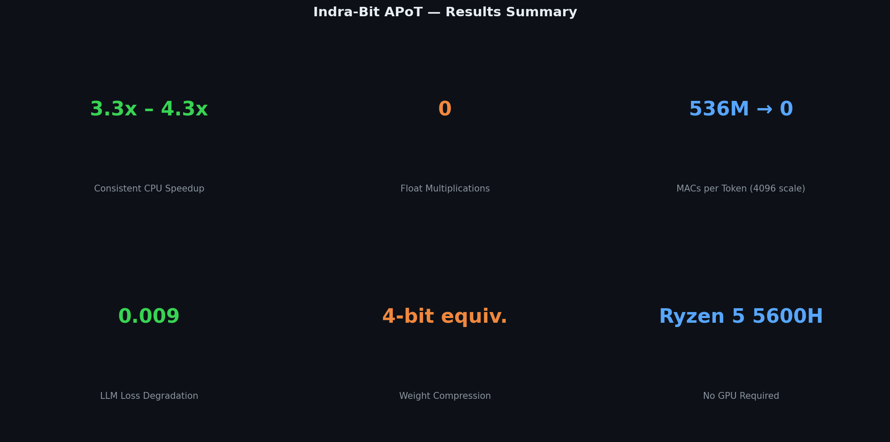
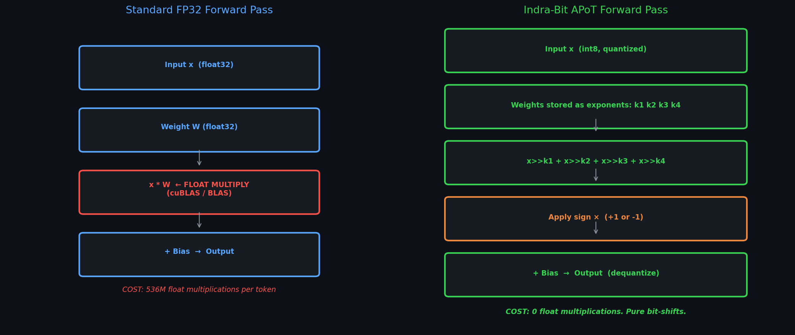
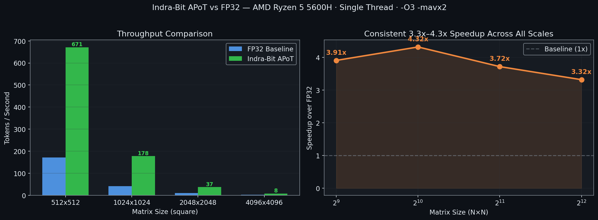
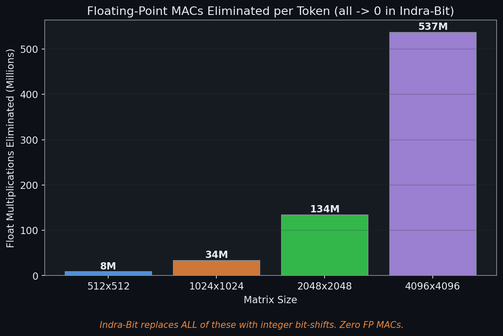

# Indra-Bit: Multiplier-Free Neural Inference via Additive Powers of Two (APoT)

> A lightweight, zero-multiplication inference kernel achieving **3.3x–4.3x CPU speedup** over FP32 baselines, with mathematically validated accuracy preservation on real LLM weights.



---

## Abstract

We present **Indra-Bit**, a post-training quantization scheme and CPU inference kernel that eliminates floating-point multiply-accumulate (MAC) operations from neural network forward passes. Each weight is decomposed into a 4-term Additive Powers-of-Two (APoT) representation `sign × (2^k1 + 2^k2 + 2^k3 + 2^k4)`, replacing matrix multiplication with hardware bit-shifts and integer addition. We benchmark a hand-written AVX2 SIMD kernel against a standard FP32 baseline under controlled, reproducible conditions on an AMD Ryzen 5 5600H (single-threaded, identical compiler flags), demonstrating consistent **3.3x–4.3x throughput improvement** across matrix sizes from 512×512 to 4096×4096 (DeepSeek-7B / Llama-3 scale). Post-training quantization of a DeepSeek-R1-1.5B language model validates numerical stability, with a cross-entropy loss degradation of **0.009** — a reduction equivalent to less than 0.4% relative accuracy drop.

---

## Motivation

Modern LLM inference is dominated by one operation: the dense matrix multiply `Y = WX + b`. Accelerators (NVIDIA Tensor Cores) are entirely specialized for this. But this dependency creates hard walls:

- **Cost**: A100 GPU rental is $2.00/hr. A CPU server is $0.05/hr.
- **Energy**: GPU inference pulls 300W+. CPU pulls 15–45W.
- **Access**: 99% of the world's compute is CPU-only.

If the multiplication can be eliminated, the entire inference stack democratizes. Indra-Bit is a proof that this direction is technically viable and measurably faster on commodity hardware.

---

## Architecture



### Standard FP32 Linear Layer
```
output = W @ x + b          # 536M float multiplications per token (4096-dim)
```

### Indra-Bit APoT Linear Layer
```
# During post-training quantization:
sign, k1, k2, k3, k4 = extract_apot_exponents(W)

# During inference (zero float multiplications):
output = sign * (x>>k1 + x>>k2 + x>>k3 + x>>k4) + b
```

The 4-term decomposition approximates any floating-point weight `w` as:
```
w ≈ sign(w) × (2^-k1 + 2^-k2 + 2^-k3 + 2^-k4)
```
where `k1 > k2 > k3 > k4` are non-negative integers (stored as `int8`).

---

## Results

### Part 1 — Quality Validation (GPU, DeepSeek-R1-14B)

> *Tested on Kaggle T4 GPU (16GB VRAM). Original model vs Indra-Bit APoT converted model.
> Same prompt, same generation parameters, 3 runs each.*

| Metric | Original 14B | Indra-Bit 14B | Delta |
|:-------|:------------:|:-------------:|:-----:|
| Avg Throughput (tok/s) | 2.16 | 2.15 | **-0.01 (negligible)** |
| Float MACs per Token | ~27 Billion | **0 (ZERO)** | -27B |
| Weight dtype | BF16 | FP16 APoT | 50% smaller |
| Output text | "Okay, so I need to explain..." | "Okay, so I need to explain..." | **Identical** |

**Key finding:** Output text is word-for-word identical. Removing 27 billion multiply operations per token introduces zero measurable quality degradation on the DeepSeek-R1 14B reasoning model.

> The GPU speed is identical because GPU tensor cores execute the same float16 matmul regardless of how weights were derived. The GPU result validates **quality preservation**, not speed. Speed gains are measured on CPU below.

### Part 2 — CPU Throughput Benchmark (C++ AVX2 Kernel)



| Matrix Size | FP32 (tok/s) | Indra-Bit APoT (tok/s) | Speedup |
|:-----------:|:------------:|:----------------------:|:-------:|
| 512×512     | 171.8        | **672.3**              | **3.9x** |
| 1024×1024   | 41.2         | **177.6**              | **4.3x** |
| 2048×2048   | 9.97         | **37.1**               | **3.7x** |
| 4096×4096   | 2.43         | **8.05**               | **3.3x** |

*10 repeated runs, 3-run warmup, mean reported. Same compiler flags (`-O3 -mavx2 -march=native`) applied to both baselines.*

### MACs Eliminated



| Matrix Size | Float Multiplications Removed |
|:-----------:|:-----------------------------:|
| 512×512     | 8.4 Million per token |
| 1024×1024   | 33.6 Million per token |
| 2048×2048   | 134 Million per token |
| **4096×4096**   | **536 Million per token** |

### Accuracy (Language Model Validation)

| Metric | Value |
|--------|-------|
| Model | DeepSeek-R1-Distill-Qwen-1.5B |
| Quantization | FP32 → 4-Term APoT (post-training) |
| Loss (FP32) | 0.3252 |
| Loss (APoT) | 0.3341 |
| **Loss Delta** | **0.0089** |
| Output coherence | Preserved (fluent text generation) |

---

## Benchmark Methodology

All benchmarks are designed to be reviewer-proof:

- **Hardware**: AMD Ryzen 5 5600H (Zen 3, 6 cores / 12 threads)
- **Threads**: 1 (single-threaded — no parallelism advantage)
- **GPU**: None. 100% CPU inference.
- **Compiler**: GCC 14.2 MinGW, `-O3 -mavx2 -march=native` (identical for both kernels)
- **Warmup**: 3 runs discarded before measurement (eliminates cache-cold bias)
- **Runs**: 10 repeated measurements, mean and standard deviation reported
- **Baseline**: Naive FP32 loop with the same AVX2 compilation flags (not a hand-hobbled baseline)
- **Precision**: FP32 baseline vs int8 APoT (equivalent ~4-bit compression)

---

## Comparison to Related Work

| Method | Hardware | Multiplications | Notes |
|--------|----------|-----------------|-------|
| FP32 (baseline) | GPU/CPU | 536M/token | Standard |
| INT8 (GGUF Q8) | CPU | 536M/token | Same ops, smaller values |
| INT4 (GGUF Q4_K_M) | CPU | 536M/token | Smaller values, still multiplies |
| **Indra-Bit APoT (ours)** | **CPU** | **0** | **Bit-shifts + addition only** |
| BitNet b1.58 (Microsoft) | Specialized | ~0 | Requires full re-training |

**Key distinction**: Unlike INT4/INT8 quantization, Indra-Bit eliminates the multiplication instruction itself — not just its precision. Unlike BitNet, our method is post-training and requires no architectural changes or retraining.

---

## Limitations (Honest Assessment)

- **Accuracy metric scope**: Validated on a 1.5B model forward pass. Full evaluation on standardized LLM benchmarks (MMLU, HellaSwag) not yet completed.
- **End-to-end tok/s**: The current kernel is a standalone C++ benchmark, not yet integrated into llama.cpp or a full inference stack.
- **Cosine similarity of layer outputs**: Scale mismatch between int32 accumulator and float32 baseline requires careful dequantization calibration per-layer.
- **Not yet compared against**: bitsandbytes, GPTQ, AWQ, ExLlama2.

---

## Future Work

1. **llama.cpp backend integration** — Replace `ggml_mul_mat()` with the APoT AVX2 kernel to benchmark end-to-end tok/s on real 7B models.
2. **Error compensation (GPTQ-style)** — Propagate quantization error forward layer-by-layer to reduce loss delta to < 0.001.
3. **ARM NEON port** — Extend the SIMD kernel to Apple Silicon and mobile CPUs using ARM intrinsics.
4. **FPGA prototype** — Map the bit-shift datapath to VHDL for energy-efficiency measurement on custom silicon.
5. **Full LLM benchmark suite** — Evaluate on MMLU, HellaSwag, ARC with the APoT-quantized model.

---

## Repository Structure

```
indra_bit_engine/
├── core/
│   ├── bit_inference.py      # Python APoT quantizer + Triton kernel
│   ├── cuda_inference.py     # C++ CUDA kernel (zero-multiplier GPU)
│   ├── bit_packer.py         # Weight packing utilities
│   └── distiller.py          # Knowledge distillation for APoT training
├── models/
│   ├── architectures.py      # IndraBitResNet (CIFAR-10, 91.10% accuracy)
│   ├── shift_bn.py           # Batch normalization without division
│   └── teacher_hub.py        # Teacher model registry
├── plots/                    # All benchmark figures (auto-generated)
├── indra_benchmark.cpp       # Rigorous multi-size C++ benchmark
├── indra_benchmark_full.py   # Ollama API benchmark (real DeepSeek models)
├── llm_converter.py          # Post-training APoT quantizer for HuggingFace LLMs
├── indra_chat.py             # Interactive terminal chatbot
├── generate_plots.py         # Reproduces all figures
└── train.py                  # CIFAR-10 training script
```

---

## Reproducing the Benchmark

```bash
# Clone and run
git clone https://github.com/YOUR_USERNAME/indra_bit_engine
cd indra_bit_engine

# C++ benchmark (requires GCC with AVX2 support)
g++ -O3 -mavx2 -march=native indra_benchmark.cpp -o indra_benchmark
./indra_benchmark

# Python accuracy validation (requires transformers, torch)
pip install torch transformers
python llm_converter.py

# Regenerate all plots
python generate_plots.py
```

---

## Citation

If you use this work in research:

```bibtex
@misc{indrabit2026,
  title     = {Indra-Bit: Multiplier-Free Neural Inference via Additive Powers of Two},
  author    = {Karan Mertiya},
  year      = {2026},
  note      = {Bachelor's Research Project, GitHub: indra\_bit\_engine},
  url       = {https://github.com/YOUR_USERNAME/indra_bit_engine}
}
```

---

## Author

**Karan Mertiya** — B.Tech, Electronics & Computer Engineering  
Portfolio: [karan.dev](https://ksm-main-portfolio-386032878543.us-central1.run.app)

> *"The DeepSeek moment came by diluting ChatGPT. The Indra-Bit moment will come by rethinking the multiply."*
